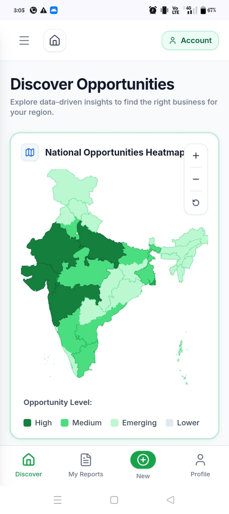
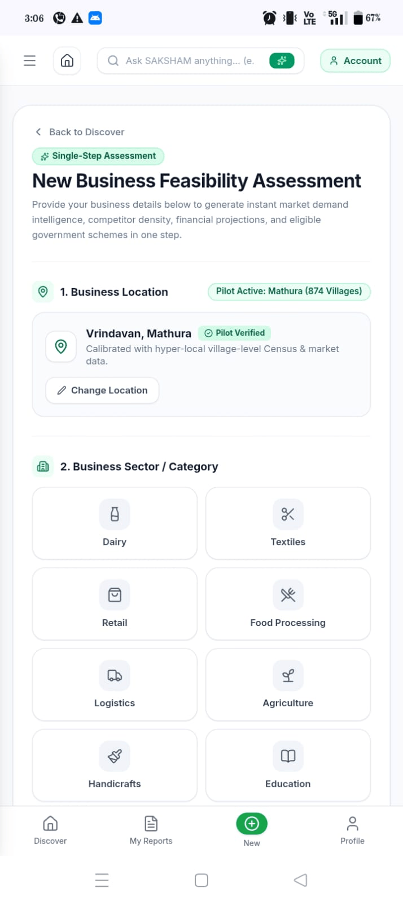
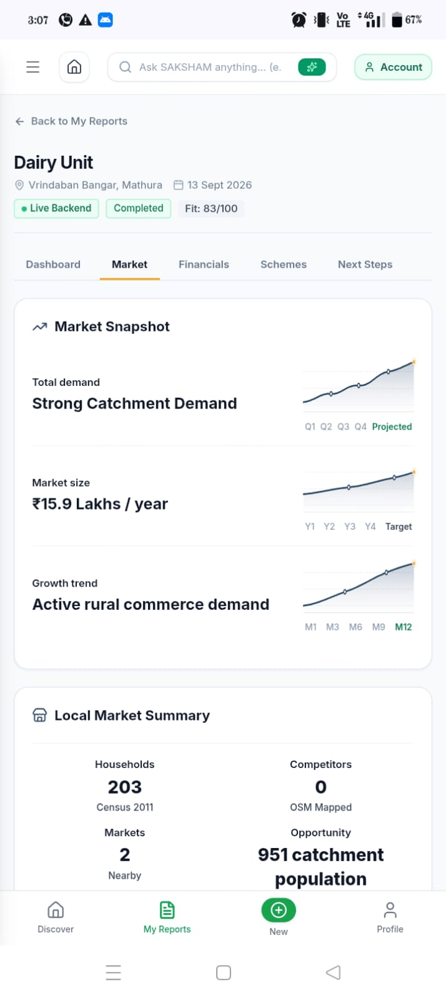
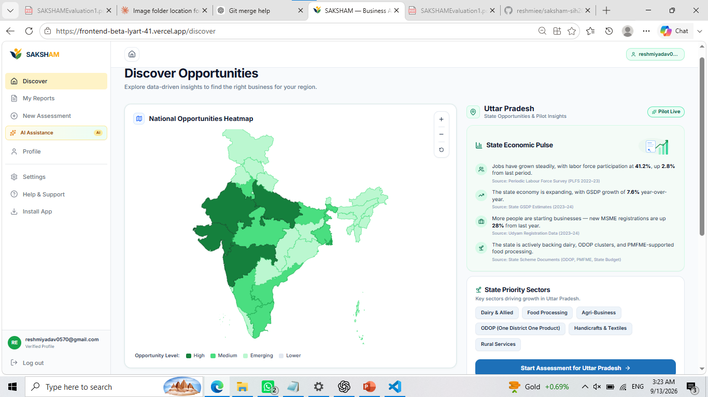
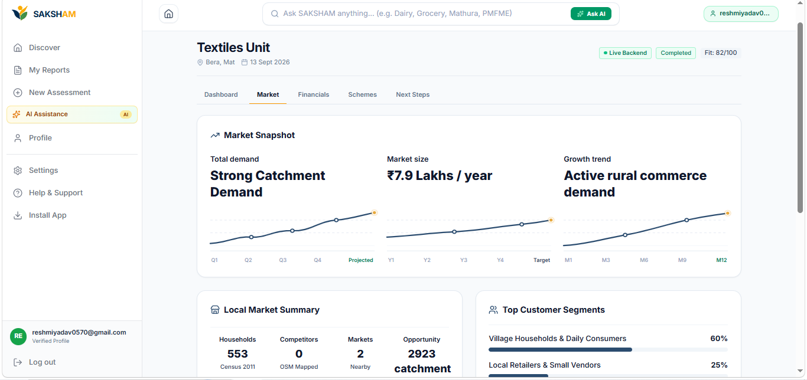

<div align="center">


**AI-Driven Hyper-Local Business Advisory & Financial Structuring Assistant for Rural Micro-Entrepreneurs**

> **The decision layer rural entrepreneurs are missing: hyper-local feasibility, deterministic financial structuring, and government scheme routing, grounded in real Census and geo data.**

[](backend)
[](frontend)
[](ai)
[](#-getting-started)

[Problem](#-the-problem) · [What we built](#-what-saksham-is) · [Why SAKSHAM](#-why-saksham) · [Architecture](#-system-architecture) · [How it Works](#how-an-assessment-works) · [Product Walkthrough](#-product-walkthrough) · [Tech Stack](#-tech-stack) · [Getting Started](#-getting-started) · [API](#-api-overview) · [Team](#-team)

</div>

<p align="center">
  
</p>

---

##  The Problem

Rural entrepreneurs can access concessional government credit (10% margin money, 90% funded by a Channelizing Agency), but there's no decision layer to turn "I have ₹1,00,000" into "start this business, get this loan, pay this EMI." **SIH Problem Statement #91** asks for that layer, on two real schemes:

| | Micro Finance Scheme | Term Loan Scheme |
|---|---|---|
| Project cost range | Up to ₹1.40 lakh | ₹1.40 lakh to ₹50 lakh |
| Loan share | Up to 90% (max ₹1.25 lakh) | Up to 90% (max ₹45 lakh) |
| Interest rate | 6.5% p.a. | 8% p.a. |
| Tenure | 3 years | 7 years |
| Moratorium | 3 months | 6 months |

```
Project Cost = Available Margin Capital ÷ 10%
Max Loan     = 90% of Project Cost (capped at scheme ceiling)
Scheme       = Micro Finance (≤ ₹1.40L)  or  Term Loan (₹1.40L to ₹50L)
```

Three inputs (**Location, Available Margin Capital, Business Category**) in; a **Feasibility Report** and a **Financial Calculator & Scheme Router** out.

##  What SAKSHAM Is

A **decision-support system**, not a chatbot, not a loan-approval engine. Every number traces back to a formula or a cited document, never an LLM guess:

```
DATA PROVIDES EVIDENCE  ->  DETERMINISTIC ENGINES CALCULATE  ->  AI EXPLAINS
```

| SAKSHAM is | SAKSHAM is *not* |
|---|---|
| A hyper-local feasibility + financial structuring advisor | A loan approval system (the bank/SCA still decides) |
| A decision-support tool with a Business Fit Score | A guaranteed business-success predictor |
| Grounded in cited government scheme text and real geo data | A generic chatbot that answers from its own memory |
| Explicit about data recency and confidence | A government portal replacing official application systems |

**Eligibility vs. Suitability:** Eligibility is the max you could finance; Suitability is what's actually recommended for *this* business, location, and capital.

**Evidence honesty:** every non-computed figure is labeled with age/source (e.g. Census baselines shown as baselines, not "current"); template data is flagged `is_template_data = true` end to end, enforced in code and not just disclaimed (see [`ai/grounding`](ai/grounding)).

##  Why SAKSHAM

| Capability | **SAKSHAM** | Aggregators | AI chatbot | Scheme portals | Bank / CA |
|---|:---:|:---:|:---:|:---:|:---:|
| Feasibility for your *exact* village | ✅ Census + OSM | ❌ | ⚠️ Only if fed data | ❌ | ✅ not scalable |
| Fixed-formula financial math | ✅ | ⚠️ EMI only | ❌ Can invent figures | ❌ No calculator | ✅ manual |
| Claims traced to cited sources | ✅ | ❌ | ❌ | ⚠️ Static docs | Depends |
| Eligibility *and* Suitability shown separately | ✅ | ❌ Max only | ❌ | ❌ | ⚠️ Sometimes |
| Multilingual, low-end-phone PWA | ✅ | ⚠️ Rare | ⚠️ Depends on prompting | ⚠️ Rare | ⚠️ Depends |
| Free, no travel/appointment | ✅ | ✅ | ✅ | ✅ jargon-heavy | ❌ Cost barrier |
| Flags stale/illustrative data | ✅ | ❌ | ❌ | ⚠️ Varies | ⚠️ Varies |

Aggregators calculate but don't localize; chatbots localize but can't cite; portals inform but don't advise. SAKSHAM: **deterministic finance + local evidence + a language layer that only explains.**

##  System Architecture


<p align="center"></p>

`Frontend` → `Backend (:8000)` → deterministic engines + Postgres → `AIClient` → `AI/RAG microservice (:8001)`. If the AI service is down, it falls back to rule-based explanations, never fails, never fabricates.

<details>
<summary>Additional diagrams (RAG pipeline, scheme routing, ER diagram, API sequence, navigation map)</summary>

| | |
|---|---|
| **RAG Pipeline** |  |
| **Scheme Routing Logic** |  |
| **Database ER Diagram** |  |
| **API Sequence Diagram** |  |
| **New Assessment Flow** |  |
| **Assessment Status Lifecycle** |  |

</details>

**Why RAG:** the knowledge base is static, authoritative, and small, so retrieval + citation beats a model "remembering" facts. Every claim is checked against a real `chunk_id`/`document_id` before it's shown.

### How an Assessment Works

```
1. User submits Location + Available Capital + Business Category.

2. Deterministic engines run first:
   a. Financial engine computes Project Cost, Max Loan, EMI, scheme match
   b. Feasibility engine pulls Census + OSM data for that exact village
   c. Fit Score is calculated from real numbers, not a model guess

3. Structured results are packaged as an evidence pack and sent to the
   AI/RAG microservice.

4. The AI layer retrieves supporting chunks from ChromaDB and assembles
   a grounded, cited explanation; it never recalculates or overrides
   the engine's numbers.

5. If the AI microservice is unreachable, step 4 is skipped and a
   rule-based explanation is used instead. The report is never blocked
   on the AI layer being up.
```

This is why every SAKSHAM number is traceable: the AI only ever explains what the engines already computed.

###  UI Mockups


**Mobile**

<table>
<tr>
<td align="center" width="33%">
<br>
<sub>Discover: top movers, map, categories</sub>
</td>
<td align="center" width="33%">
<br>
<sub>My Reports, New Assessment, Created</sub>
</td>
<td align="center" width="33%">
<br>
<sub>Dashboard, Market, Financials & Next Steps tabs</sub>
</td>
</tr>
</table>

**Desktop**

<table>
<tr>
<td align="center" width="33%">
<br>
<sub>Discover: top movers, map, categories</sub>
</td>
<td align="center" width="33%">
<br>
<sub>My Reports, New Assessment, Created</sub>
</td>
<td align="center" width="33%">
<br>
<sub>Dashboard, Market, Financials & Next Steps tabs</sub>
</td>
</tr>
</table>

##  Tech Stack

| Layer | Technology |
|---|---|
| **Frontend** | Next.js 16 (Turbopack, App Router), React 19, TypeScript, Tailwind CSS 4, MapLibre GL / react-map-gl, Vitest + Testing Library |
| **Backend** | FastAPI, SQLAlchemy 2, Alembic, PostgreSQL (Neon) / SQLite, Pydantic, JWT (`python-jose`, `bcrypt`) |
| **AI / RAG** | FastAPI, ChromaDB (offline sentence-transformer embeddings), deterministic grounded explanation layer, `pdfplumber` |
| **Data** | Census / DCHB demographics, OpenStreetMap, curated PMFME + district + entrepreneurship documents |
| **Quality** | `pytest` + `pytest-cov`, `radon`, `vulture`, ESLint + `sonarjs`, `tsc --strict`, Vitest coverage |

##  Repository Structure

```
saksham-sih2026/
├── frontend/            Next.js PWA: Discover, New Assessment, Dashboard, Compare, Schemes
├── backend/              FastAPI gateway: auth, assessments, locations, schemes, insights, AI gateway
│   ├── app/engines/      Deterministic financial + feasibility engines
│   ├── app/routers/      REST endpoints
│   ├── app/db/           SQLAlchemy models, queries, Alembic migrations
│   └── tests/
├── ai/                   Standalone AI/RAG microservice
│   ├── ingestion/        PDF extraction, cleaning, chunking (never touches source PDFs)
│   ├── knowledge_base/   4 curated source documents + generated chunks
│   ├── retrieval/        ChromaDB vector store + retriever
│   ├── grounding/        Evidence pack construction, warning/disclaimer enforcement
│   ├── prompts/          Query parser + grounded explanation prompt & validator
│   ├── service/          FastAPI app exposing /query
│   └── tests/
├── docs/                 Master reference, API contracts, data dictionary, work logs
├── diagrams/             Architecture, ERD, sequence, flowchart and UI concept exports
├── RULES.md              Hard code-quality gates (see below)
└── AGENTS.md             Living task/handoff log between build sessions
```

##  Getting Started

### Prerequisites
- Python 3.11+ and Node.js 20+
- PostgreSQL (e.g. [Neon](https://neon.tech)), or just use local SQLite

### 0. Clone
```bash
git clone https://github.com/<your-org>/saksham-sih2026.git
cd saksham-sih2026
```

### 1. AI / RAG microservice (port 8001)
```bash
cd ai
pip install -r requirements.txt
python -m ai.ingestion.chunk_documents      # (re)build chunks, if needed
python -m ai.ingestion.embed_and_store      # build/refresh ChromaDB
uvicorn ai.service.main:app --reload --port 8001
```

### 2. Backend gateway (port 8000)
```bash
cd backend
pip install -r requirements.txt
cp ../.env.example .env        # DATABASE_URL / JWT_SECRET_KEY, or leave unset for SQLite
alembic upgrade head            # or: python create_tables.py
uvicorn app.main:app --reload --port 8000
```

### 3. Frontend (port 3000)
```bash
cd frontend
cp .env.example .env.local     # NEXT_PUBLIC_BACKEND_URL=http://localhost:8000
npm install
npm run dev
```

Open **http://localhost:3000**. If the AI microservice isn't running, assessments still work; the backend falls back to rule-based advisory text.

### Common frontend commands
```bash
npm run dev             # dev server (Turbopack)
npm run build            # production build
npm run start            # run production build
npm run lint             # ESLint
npm run test              # Vitest once
npm run test:watch        # Vitest watch mode
npm run test:coverage     # Vitest with coverage
```

### Common backend commands
```bash
uvicorn app.main:app --reload --port 8000    # dev server with hot reload
alembic revision --autogenerate -m "message"  # new migration
alembic upgrade head                          # apply migrations
pytest tests/ --cov                            # tests with coverage
python create_tables.py                        # quick local SQLite bootstrap
```

##  API Overview

All routes served by the backend gateway (`:8000`); the frontend never talks to the AI microservice directly.

| Method | Endpoint | Purpose |
|---|---|---|
| `POST` | `/api/v1/assess` | Run a full assessment |
| `GET` | `/api/v1/assess/{id}` | Fetch a persisted assessment |
| `GET` | `/api/v1/assess/history` | List a user's past assessments |
| `GET` | `/api/v1/assess/my-reports` | Assessments for "My Reports" screen |
| `GET` | `/api/v1/locations?q=` | Live village/block/district search |
| `POST` | `/api/v1/locations/resolve` | Resolve free-text location to a canonical village |
| `GET` | `/api/v1/schemes` | List financing schemes |
| `POST` | `/api/v1/schemes/calculate-emi` | Reducing-balance EMI simulator |
| `POST` | `/api/v1/schemes/match` | Match project cost to correct scheme |
| `GET` | `/api/v1/insights/{location}` | Hyper-local demand/category insights |
| `POST` | `/api/v1/ai/query` | Conversational AI advisory gateway |
| `POST` | `/api/v1/auth/*` | Registration, login, Google sign-in, profile |

Full contracts: [`docs/api-contracts.md`](docs/api-contracts.md).

**Run an assessment:**

```bash
curl -X POST http://localhost:8000/api/v1/assess \
  -H "Content-Type: application/json" \
  -d '{"location": "Kheragarh, Agra", "available_capital": 100000, "category": "dairy"}'
```

```json
{
  "assessment_id": "a1b2c3d4",
  "fit_score": 78,
  "project_cost": 200000,
  "recommended_scheme": "Micro Finance Scheme",
  "max_eligible_loan": 125000,
  "suggested_loan": 160000,
  "confidence": "medium",
  "generated_at": "2026-09-13T10:00:00.000Z"
}
```

### The three formulas everything else is built on

```
Project Cost          = Available Margin Capital ÷ 10%
Maximum Eligible Loan = min(Project Cost × 90%, Scheme Ceiling)

EMI = P × r × (1+r)^n / [(1+r)^n − 1]     where r = annual rate / 12,  n = tenure minus moratorium (months)

Fit Score = (Market × 0.30) + (Competition × 0.25) + (Capital Fit × 0.25) + (Infrastructure × 0.20)
  >= 80 Highly Feasible   |   65 to 79.9 Feasible   |   50 to 64.9 Moderate Fit   |   < 50 High Risk
```

Live in [`backend/app/engines`](backend/app/engines); the AI layer never touches them.

##  Team

| Area | Members |
|---|---|
| Frontend & UI | Jhalak Mittal, Reshmi Yadav |
| Database & Backend | Neha Malhotra, Sachin Gola |
| RAG & LLM | Dushyant Sharma, Divyansh |

Per-contributor logs: [`docs/work-log`](docs/work-log).

##  Acknowledgements

- Village and block demographic baselines from the **Census of India / DCHB**
- Competitor and market mapping from **OpenStreetMap**
- Scheme and project guidance curated from **PMFME**, district industrial profiles, and entrepreneurship manuals
- Vector retrieval powered by **ChromaDB**, running fully offline
- Map rendering via **MapLibre GL** / **react-map-gl** on OSM tiles